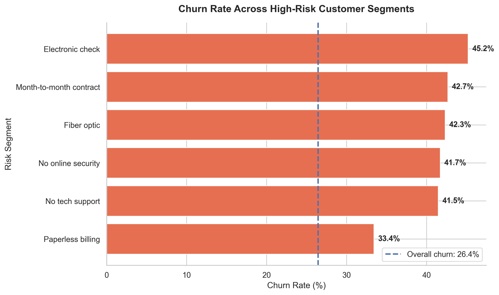
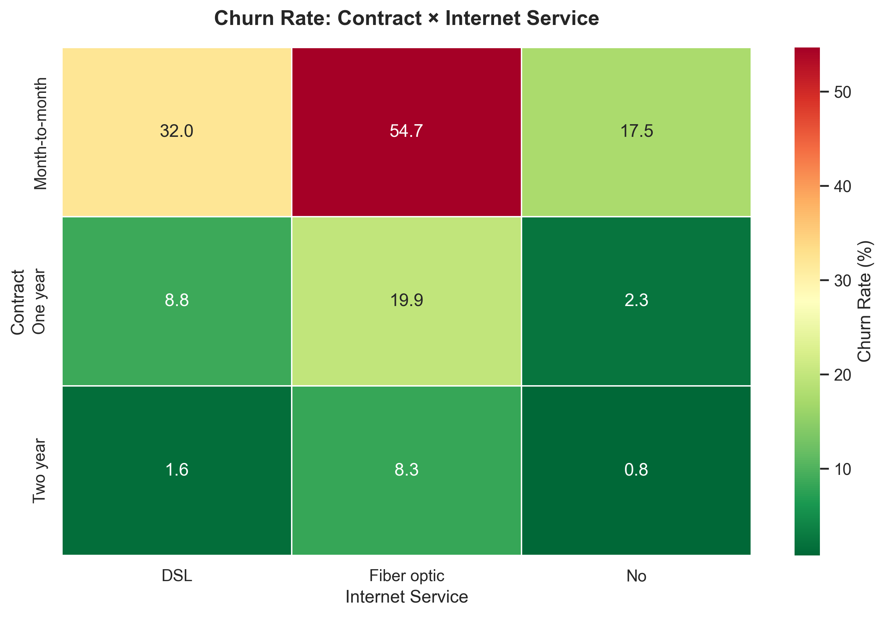

# Customer Churn Prediction & Retention Engine

**Status: Work in progress — initial project setup.**

## Project Goal

Build a machine learning project that classifies customer churn
using a public telecom dataset and explores candidate retention actions.

## Planned Workflow

1. Document the dataset source and inspect data quality.
2. Create a holdout split before fitting preprocessing.
3. Explore the training data.
4. Build preprocessing and baseline models.
5. Compare models using appropriate evaluation metrics.
6. Explain model predictions.
7. Add rule-based retention suggestions.
8. Build a Streamlit demonstration and automated tests.

## Current Progress
- Analyzed churn rates across payment method, internet service, tech support, online security, and paperless billing.
- Built a combined high-risk customer segment comparison.
- Analyzed the Contract × Internet Service interaction.
- Completed the Week 1 business insights report.

### Day 5 — Service & Billing Analysis




Full written findings: [Week 1 Business Insights](reports/week1_business_insights.md)

## Local Setup — Windows PowerShell

Run these commands from the project root:

```powershell
.\.venv\Scripts\python.exe -m pip install -r requirements.txt
```

If you need to create the virtual environment:

```powershell
& "C:\Users\gurmeet singh\AppData\Local\Programs\Python\Python310\python.exe" -m venv .venv
```

## Important Limitation

Retention suggestions will initially be rule-based ideas for testing.
They should not be interpreted as proven ways to prevent churn.