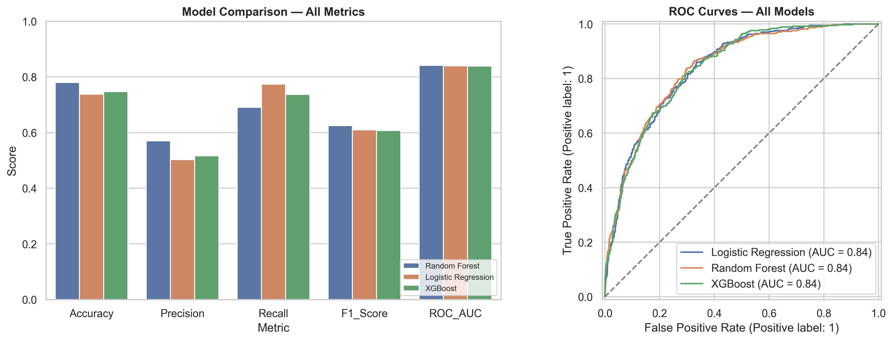
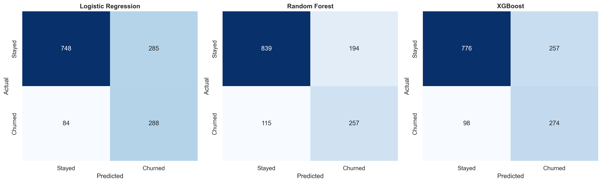

# Customer Churn Prediction & Retention Engine

**Status: Work in progress — initial project setup.**

## Project Goal

Build a machine learning project that classifies customer churn
using a public telecom dataset and explores candidate retention actions.

## Planned Workflow

1. Document the dataset source and inspect data quality.
2. Create a holdout split before fitting preprocessing.
3. Explore the training data.
4. Build preprocessing and baseline models.
5. Compare models using appropriate evaluation metrics.
6. Explain model predictions.
7. Add rule-based retention suggestions.
8. Build a Streamlit demonstration and automated tests.

## Current Progress
- Trained 3 baseline models: Logistic Regression, Random Forest, and XGBoost.
- Evaluated models using Accuracy, Precision, Recall, F1-score, and ROC-AUC.
- Random Forest achieved the best baseline ROC-AUC of 0.8411.
- Added model training module (`src/train_model.py`) with unit tests.

## Model Performance

| Model | Accuracy | Precision | Recall | F1-Score | ROC-AUC |
|---|---:|---:|---:|---:|---:|
| Random Forest | 0.7801 | 0.5698 | 0.6909 | 0.6245 | 0.8411 |
| Logistic Regression | 0.7374 | 0.5026 | 0.7742 | 0.6095 | 0.8399 |
| XGBoost | 0.7473 | 0.5160 | 0.7366 | 0.6069 | 0.8393 |





### Day 6 — Feature Engineering & Preprocessing

The project now uses a reusable scikit-learn preprocessing pipeline.

- Numeric features → median imputation + standard scaling
- Categorical features → most-frequent imputation + one-hot encoding
- Unknown categories are handled safely using `handle_unknown="ignore"`
- Two interpretable engineered features were created:
  - `AvgMonthlyCharge`
  - `TenureGroup`
- Preprocessing is fitted only on training data to prevent data leakage.
- Final feature matrix contains **50 features**.


## Local Setup — Windows PowerShell

Run these commands from the project root:

```powershell
.\.venv\Scripts\python.exe -m pip install -r requirements.txt
```

If you need to create the virtual environment:

```powershell
& "C:\Users\gurmeet singh\AppData\Local\Programs\Python\Python310\python.exe" -m venv .venv
```

## Important Limitation

Retention suggestions will initially be rule-based ideas for testing.
They should not be interpreted as proven ways to prevent churn.